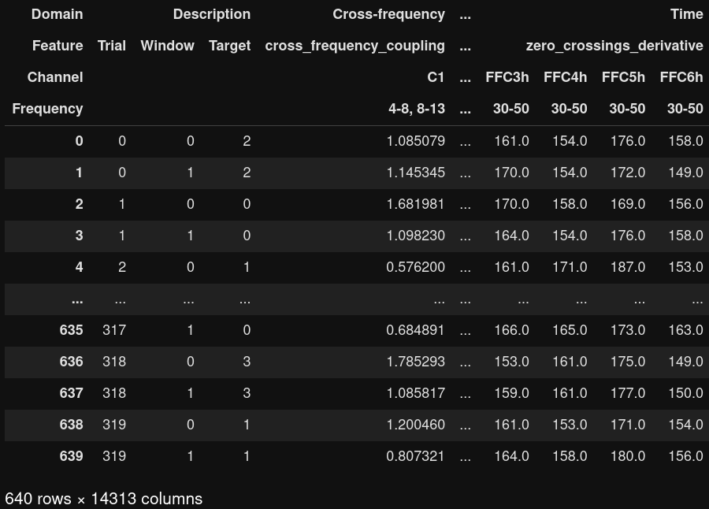

# Welcome to braindecode-features!  
## What is this repository?
This repository is an extension to the [braindecode](https://github.com/braindecode/braindecode) library.  
It adds extraction of features as well as convenience functions to run feature-based decoding.  
The purpose of this library is to facilitate the generation of strong feature-based baselines. 

## What does it do?
braindecode-features offers a way to get from preprocessed data in the form of braindecode BaseDatasets `(n_channels x n_times)` to a feature representation `(n_windows x n_features)`.  
It implements several extraction routines suitable to extract features that cover different properties of EEG signals.  
This includes univariate and bivariate time domain features, features based on Fourier, Hilbert, and wavelet transform, as well as cross-frequency features.

## How does it work?
Basic usage of braindecode-features is straightforward and demonstrated in the code cell below:
```python
# Assume we have data given as a braindecode BaseConcatDataset of BaseDatasets
# We define a number of frequency bands which we are interested in
frequency_bands = [(0, 4), (4, 8), (8, 13), (13, 30), (30, 50)]
# We extract the features
from braindecode_features import extract_ds_features
feature_df = extract_ds_features(
    ds=data,
    frequency_bands=frequency_bands,
)
```
The function will automatically extract all implemented features and return a feature DataFrame.

## What is the feature DataFrame?
The feature DataFrame is the key data structure in this repository which looks as follows:  
  
The DataFrame has an explicit 4-level MultiIndex corresponding to feature domain, feature type, channel(s), and frequency band(s).  
The first domain `Description` is a special case and does not hold any features but information required for decoding, i.e.  
`Trial` – the trial the features were extracted from. It is equivalent to the number of datasets in the braindecode WindowsDataset,  
`Window` – the compute window the features were extracted from. It is equivalent to the length of the braindecode WindowsDataset,  
`Target` – the decoding targets.  
In the following columns, all extracted features are stored.

## Why are there different domains and what are they?  
The domains differ in the way they filter the data, and also in the way they pass data to the feature extraction functions.
### [Time](https://github.com/gemeinl/braindecode-features/blob/04718dbe59c47f4034bcf65ff297456314b92ac3/braindecode_features/domains/time.py#L95)  
The time extraction routine filters the continuous data in time domain to the specified frequency bands (does not filter again, if another domain already filtered in time domain). Afterwards it cuts windows. Features are computed one dataset and frequency band at a time and the shape that is passed to the time feature extraction functions is `(n_windows x n_channels x n_times)`.  
Features implemented with this domain are:  
- covariance
- energy
- higuchi_fractal_dimension
- interquartile_range
- kurtosis
- line_length
- maximum
- mean
- median
- minimum
- petrosian_fractal_dimension
- root_mean_square
- skewness
- standard_deviation
- variance
- zero_crossings
- zero_crossings_derivative

### [Fourier](https://github.com/gemeinl/braindecode-features/blob/master/braindecode_features/domains/fourier.py)  
The Fourier extraction routine takes the original unfiltered continuous signals. It cuts windows, transforms the data using the [Fourier transform](https://en.wikipedia.org/wiki/Fourier_transform) and picks frequency bins corresponding to the specified frequency bands. The number of bins depends on the width of the frequency band, such that the last dimension of the shape passed to the Fourier feature extraction functions is flexible. Features are computed one dataset and frequency band at a time and the shape that is passed to the Fourier feature extraction functions is `(n_windows x n_channels x n_fourier_coefficients)`.  
Features implemented with this domain are:  
- maximum
- mean
- median
- minimum
- peak_frequency
- power
- standard_deviation
- value_range
- variance

### [Wavelet](https://github.com/gemeinl/braindecode-features/blob/master/braindecode_features/domains/wavelet.py)  
The Fourier extraction routine takes the original unfiltered continuous signals. It transforms the data using the [continuous wavelet transform](https://en.wikipedia.org/wiki/Continuous_wavelet_transform) with a [Morlet mother wavelet](https://en.wikipedia.org/wiki/Morlet_wavelet) at scales corresponding to pseudo frequencies (with stepwidth 1) within the specified frequency bands. The number of scales depends on the width of the frequency band, such that the first dimension of the shape passed to wavelet feature extraction functions is flexible. Afterwards it cuts windows. Features are computed one dataset and frequency band at a time and the shape that is passed to the wavelet feature extraction functions is `(n_scales x n_windows x n_channels x n_times)`. Features are afterwards averaged over the dimension of scales.  
Features implemented with this domain are:  
- bounded_variation
- maximum
- mean
- median
- minimum
- power
- standard_deviation
- value_range
- variance

### [Hilbert](https://github.com/gemeinl/braindecode-features/blob/master/braindecode_features/domains/hilbert.py)  
The Hilbert extraction routine filters the continuous data in time domain to the specified frequency bands (does not filter again, if another domain already filtered in time domain). It processes the data using the Hilbert transform and cuts windows. Features are computed one dataset and one frequency band at a time and the shape that is passed to the hilbert feature extraction functions is `(n_windows x n_channels x n_times)`.  
Features implemented with this domain are:  
- phase_locking_values

### [Cross-frequency](https://github.com/gemeinl/braindecode-features/blob/master/braindecode_features/domains/cross_frequency.py)  
The cross-frequency extraction routine filters the continuous data in time domain to the specified frequency bands (does not filter again, if another domain already filtered in time domain). It transforms the data of all possible pairs of two different frequency bands using [Hilbert transform](https://en.wikipedia.org/wiki/Hilbert_transform) and cuts windows. Features are computed one dataset at a time and the shape that is passed to the cross-frequency feature extraction functions is `(2 x n_windows x n_channels x n_times)`.  
Features implemented with this domain are:  
- cross_frequency_coupling

## What are the specials about the decoding part?
Inspired by the [cropped decoding](https://braindecode.org/auto_examples/plot_bcic_iv_2a_moabb_cropped.html) of the [neural networks implemented in braindecode](https://braindecode.org/api.html#models) signals were split into compute windows. In the FeatureDataFrame, they are listed as a separate column and there are multiple ways to handle them:
- Interpret every window as an independent example. This corresponds to the standard FeatureDataFrame. Note that this will require combination of window predictions in the end again to obtain trial predictions.
- Aggregate the features over all windows of a trial. Note that this eliminates all time-resolved information.
    
- Do none of the above and create giant feature vectors by appending all window features. Note that the window information is then moved from a single column to the MultiIndex. Also note that if there are a variable number of windows per trial, then the minimum number of windows of a trial has to be used for all trials to create feature vectors of the same length required for the decoders.  
    
All three options can easily be used as demonstrated in the code cell below:
```python
from braindecode_features import prepare_features
X, y, groups, feature_names = prepare_features(
    df=feature_df,
    agg_func=None,  # np.mean, np.median, ...
    windows_as_examples=False,  # True
)
```
The function will transform the FeatureDataFrame into X, y, and groups that are commonly known in machine learning.

## What are the feature names?
The feature names are generated during extraction of features and used as MultiIndex in the FeatureDataFrame. When preparing features for decoding, they are converted into a new DataFrame with the columns Domain, Feature, (Window,) Channel, and Frequency which looks as follows.  
  
The feature names allow for detailed post-hoc analysis, since they hold all required information to backtrack a feature performing well during decoding to its origin.


## How can I pick a specific subset of features for decoding?
braindecode-features offers a simple way to filter the potentially huge FeatureDataFrame to a subset of features as demonstrated below:
- filter for features that were extracted from the Fourier domain, variance features, features extracted at electrode locations that contain a 'C' in the sensor name (including bivariate features where one channel had a 'C' in its name), or features extracted at frequency band 8-13 Hz:
  ```python
  from braindecode_features import filter_df
  subset_df = filter_df(
      df=feature_df,
      query='Fourier',         # 'variance', 'C'  , '8-13'  
      exact_match=False,       # True      , False, True
      level_to_consider=None,  # 1         , 2    , 3
  )
  ```
In all cases, the filtering function preserves the entries in domain `Description` and concatenates the selection appropriately, such that `filter_df` can be called multiple times and that the resulting DataFrame is compatible with the further steps leading to decoding.

## What are the requirements?
Running the code requires following libraries:
- [numpy](https://numpy.org/)
- [pandas](https://pandas.pydata.org/)
- [scipy](https://www.scipy.org/)
- [scikit-learn](https://scikit-learn.org/stable/)
- [pywavelets](https://pywavelets.readthedocs.io/en/latest/)
- [mne](https://mne.tools/stable/index.html)
- [braindecode](https://braindecode.org/)
- [pytest](https://docs.pytest.org/en/6.2.x/)
- [joblib](https://joblib.readthedocs.io/en/latest/)
